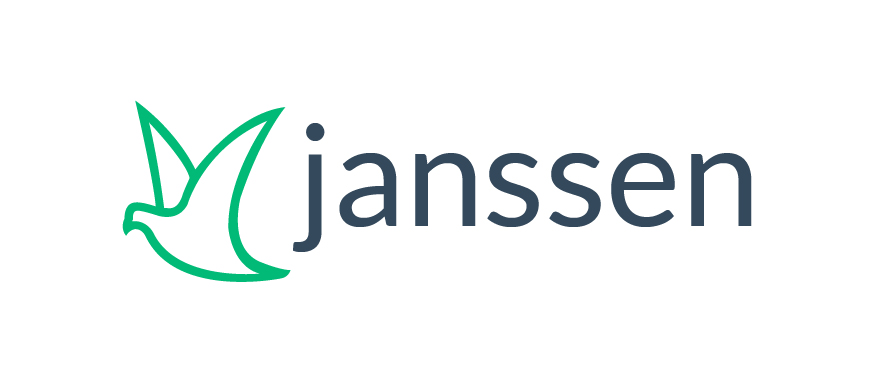

# Quick Start

Try first, ask questions later? Here's how to deploy Janssen

1. Cloud Native

```

...


```

2. VM

```

...


```

# Project Goal

The goal of the Janssen Project is to build the world's fastest cloud native identity and access management ("IAM") platform.

Why not outsource IAM to a SaaS? Well, if you can, you should! But there are a few reasons why you may not want to:
1. Your service has a large number of users or devices
2. The privacy or security profile of a hosted solution is not acceptable
3. You need the freedom to customize
4. You need to embed this component in your solution  

Ultimately, the goal of the project is to coalesce a community, and to foster an ecosystem. Many organizations, working together, can build Janssen together more effectively then any individual organization, resulting in more innovation and better code.

# Why the name Janssen?

Pigeons (or doves if you like...) are universally regarded as a symbol of peace. But they are also fast. Powered by a handful of seeds, a well trained racing pigeon can fly 1000 kilometers in a day. The Janssen brothers of Arendonk in Belgium bred the world's fastest family of racing pigeons. Complex open source infrastructure, like breeding, requires incremental improvement. Janssen racing pigeons revolutionized the sport. The Janssen Project seeks to revolutionize identity and access management.   

# Design Goals

To a large extent, we are aligning with the goals of cloud native infrastructure. But beyond that, there are a few goals that are specific to IAM:

1. High Concurrency: In IAM, the number of users is not necessarily related to performance. If you have a billion users who never login, you can accomplish this very easily! What's hard is concurrency. If you have a billion users who all login on the same day, that's hard. Janssen is designed to horizontally scale.  That means that any concurrency is attainable if you can add more compute and memory.

2. Highly Available: IAM is mission critical--many applications may depend on it. Leveraging cloud native design is helpful. But robustness is a fundamental consideration at all phases of development.

3. Highly Flexible: Open source gives you the freedom to modify the code. But having your own fork of the code might make it hard to upgrade--you'll have to merge changes. Janssen provides standard interfaces that make it possible to implement custom business logic in an upgrade-friendly manner.  

# Components
